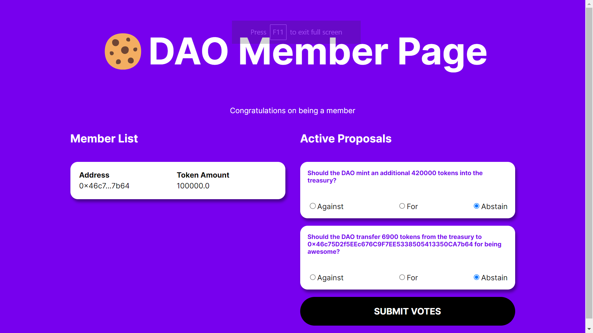

# NarutoDAO built using Ethereum Blockchain

### **Feature**
- [x] deployed your own custom ERC-20 token.
- [x] deployed your own ERC-1155 NFT people can mint to join your DAO.
- [x] deployed your own governance contract + treasury.
- [x] built a dapp that lets people connect their wallet, get an NFT, see a DAO Dashboard where they can see other members + actually vote on proposals that are executed directly by your governance contract.

### **Demo**

### **Welcome 👋**
To get started with this project, clone this repo and follow these commands:

1. Run `npm install` at the root of your directory
2. Run `npm start` to start the project
3. Start coding!
